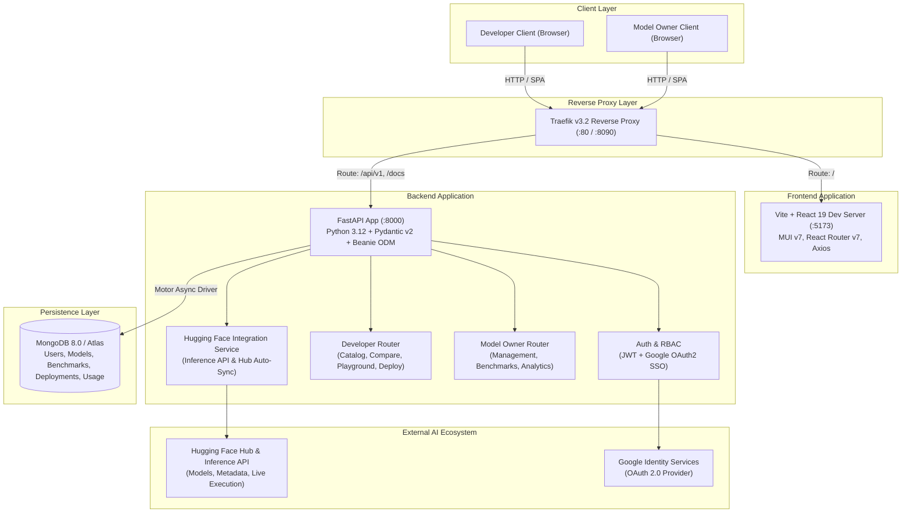
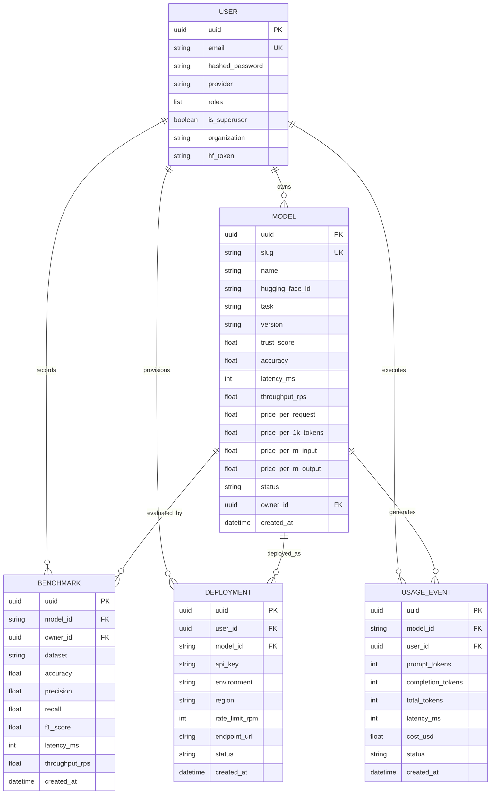

# Synapse

<div align="center">

[](https://opensource.org/licenses/MIT)
[](https://www.python.org/)
[](https://fastapi.tiangolo.com/)
[](https://reactjs.org/)
[](https://www.typescriptlang.org/)
[](https://www.mongodb.com/)
[](https://www.docker.com/)
[](https://huggingface.co/)

**A trusted AI model marketplace and deployment platform that connects AI model creators with developers, startups, and enterprises.**

[Live Demo](https://synapse-hub-web.onrender.com/) • [API Documentation](https://synapse-ai-hub.onrender.com/docs) • [Report Issue](https://github.com/flurry101/synapse/issues) • [Contributing](#contributing--developer-guide)

</div>

---

## Table of Contents

- [Overview](#overview)
- [System Architecture](#system-architecture)
- [Repository Structure](#repository-structure)
- [Key Features & Workflows](#key-features--workflows)
  - [Developer Experience](#1-developer-experience)
  - [Model Owner Experience](#2-model-owner-experience)
  - [Hugging Face Integration & Seeding](#3-hugging-face-integration--seeding)
  - [Authentication & Role Isolation (RBAC)](#4-authentication--role-isolation-rbac)
- [Endpoints & Service URLs](#endpoints--service-urls)
  - [Local Development](#local-development)
  - [Live Deployment (Render)](#live-deployment)
- [Complete REST API Reference](#complete-rest-api-reference)
- [Database Models & Schemas](#database-models--schemas)
- [Prerequisites & Environment Configuration](#prerequisites--environment-configuration)
  - [Environment Variables Matrix](#environment-variables-matrix)
- [Getting Started / Running Locally](#getting-started--running-locally)
  - [Option A: Running Frontend & Backend Individually](#option-a-running-frontend--backend-individually)
  - [Option B: Running with Docker Compose](#option-b-running-with-docker-compose-recommended-for-dev)
- [Testing & Quality Assurance](#testing--quality-assurance)
  - [1. End-to-End Authentication & Role Smoke Test](#1-end-to-end-authentication--role-smoke-test)
  - [2. Frontend Unit & Component Tests](#2-frontend-unit--component-tests)
  - [3. Backend Unit & Integration Tests](#3-backend-unit-tests)
- [Linting, Formatting & Pre-Commit Hooks](#linting--formatting)
- [Contributing & Developer Guide](#contributing--developer-guide)
- [License](#license)

---

## Overview

**Synapse** simplifies the discovery, evaluation, monetisation, and deployment of AI models. It bridges the gap between open-source model creators and developers by providing:

1. **Model Discovery & Semantic Search**: Find models by specific task, NLP requirements, trust scores, parameter sizes, or benchmark performance.
2. **Side-by-Side Model Comparison**: Compare accuracy, precision, recall, F1 scores, latency, throughput, and pricing models side-by-side.
3. **Interactive Browser Playground**: Test prompt inference in real-time with latency tracking, token counts, and cost estimation directly in the browser.
4. **1-Click Deployment & API Generation**: Provision instant API keys, endpoint configurations, and pre-generated SDK client code (Python & cURL).
5. **Model Owner Portal & Monetization**: Publish model profiles, link Hugging Face models, configure per-request / per-token pricing schemes, publish benchmark results, and monitor usage analytics in real-time.

---

## System Architecture

The following diagram outlines the high-level architecture of Synapse, illustrating the interaction between the React frontend, Traefik reverse proxy, FastAPI backend, MongoDB Beanie ODM layer, and the Hugging Face ecosystem.



---

## Repository Structure

Synapse is structured as a monorepo containing the frontend web application, backend API service, shared infrastructure configs, automated test suites, and CI/CD pipelines:

```
synapse-hub/
├── .github/
│   └── workflows/
│       ├── test.yml            # Automated CI: Python & JS linters, pytest (coverage report), vitest
│       └── build.yml           # CD pipeline: Builds & pushes Docker images to GitHub Container Registry
├── backend/
│   ├── app/
│   │   ├── auth/               # Security, password hashing (bcrypt), JWT tokens, OAuth SSO
│   │   ├── config/             # Pydantic BaseSettings configuration loader (.env)
│   │   ├── models/             # Beanie ODM MongoDB Document models
│   │   │   ├── benchmarks.py   # Benchmark document schema
│   │   │   ├── deployments.py  # Developer deployment & API key document schema
│   │   │   ├── models.py       # AI Model catalog & pricing document schema
│   │   │   ├── usage.py        # Telemetry & Playground usage event schema
│   │   │   └── users.py        # User account & role-based access schema
│   │   ├── routers/            # FastAPI API routers
│   │   │   ├── api.py          # Unified v1 router registration
│   │   │   ├── developer.py    # Developer workspace endpoints (search, compare, playground, deploy)
│   │   │   ├── login.py        # Authentication & Google OAuth callbacks
│   │   │   ├── owner.py        # Model owner endpoints (model management, pricing, analytics)
│   │   │   └── users.py        # User CRUD & profile management
│   │   ├── schemas/            # Pydantic validation & transfer schemas
│   │   ├── services/           # External service clients
│   │   │   └── huggingface.py  # Hugging Face Hub client, auto-sync engine & inference proxy
│   │   └── main.py             # FastAPI lifespan, Beanie initialization, startup data seeder
│   ├── tests/                  # Pytest test suite
│   ├── Dockerfile              # Backend production container image
│   ├── pyproject.toml          # uv / Python dependency definitions, Ruff/Black/Mypy configs
│   └── uv.lock                 # Deterministic dependency lockfile
├── frontend/
│   ├── src/
│   │   ├── components/         # Shared reusable UI components (Nav, Footers, Modals, Cards)
│   │   ├── contexts/           # React contexts (AuthContext, ThemeContext)
│   │   ├── models/             # TypeScript type definitions & interfaces
│   │   ├── routes/             # React Router route definitions & views
│   │   │   ├── developer/      # Developer views: Search, Details, Compare, Playground, Deploy
│   │   │   ├── owner/          # Model Owner views: Add Model, Model Profile, Benchmarks, Pricing, Analytics
│   │   │   ├── home.tsx        # Public landing & marketplace exploration
│   │   │   ├── login.tsx       # User login & Google SSO trigger
│   │   │   ├── register.tsx    # Role-based user registration
│   │   │   ├── profile.tsx     # Account settings & role switcher
│   │   │   └── sso.login.tsx   # Google SSO token resolution & redirection
│   │   ├── services/           # Axios HTTP client wrappers
│   │   ├── theme.tsx           # Custom Material UI (MUI v7) theme definitions
│   │   ├── router.tsx          # React Router configuration & Route Guards
│   │   └── main.tsx            # React application entrypoint
│   ├── Dockerfile              # Multi-stage production Nginx container build
│   ├── Dockerfile.development  # Live hot-reloading development container
│   ├── package.json            # NPM scripts & dependencies
│   ├── vite.config.ts          # Vite bundler configuration
│   └── tsconfig.json           # TypeScript configuration
├── scripts/
│   ├── auth-smoke-test.sh      # Automated bash E2E authentication & role-isolation verification
│   ├── auth-smoke.sh           # Quick token & user check
│   └── render-sso-check.sh     # Cloud deployment validation script
├── .env.example                # Canonical environment variable template
├── .pre-commit-config.yaml     # Git pre-commit hooks (Black, Ruff, Mypy, Yaml linting)
├── docker-compose.yml          # Multi-container local development stack (with live file sync)
├── docker-compose.prod.yml     # Production multi-container deployment stack
├── render.yaml                 # Infrastructure-as-code deployment blueprint for Render
└── README.md                   # Project documentation
```

---

## Key Features & Workflows

### 1. Developer Experience
Developers searching for AI capabilities benefit from an integrated workflow:
- **Smart Model Search & Filter**: Filter models by task category (*Text Generation*, *Summarization*, *Code Generation*, *Vision*, etc.), pricing brackets, minimum trust score, or latency thresholds.
- **Semantic Recommendation Engine** (`/developer/recommendations`): Describe a natural-language use-case (e.g. *"Fast code completion under 200ms latency"*), and receive ranked model suggestions with compatibility scores.
- **Side-by-Side Comparison Arena** (`/developer/compare`): Select 2 to 5 models to inspect side-by-side matrices of benchmark metrics (MMLU, HumanEval, GSM8K), throughput, latency, and cost per million tokens.
- **In-Browser Playground** (`/developer/playground`): Send sample prompts directly to models with configurable `temperature` and `max_tokens`. The playground executes real-time inference via Hugging Face or fallback mock simulation, capturing prompt tokens, completion tokens, latency, and estimated cost.
- **1-Click API Deployment** (`/developer/deployments`): Instantly provision dedicated API endpoints with generated bearer API keys, rate limit controls, and pre-rendered Python (`requests`/`openai` style) and cURL code snippets.

### 2. Model Owner Experience
Model creators, labs, and hosting providers have access to a dedicated dashboard:
- **Model Catalog Registration**: Register open-source or proprietary models by connecting their Hugging Face Repository ID or defining custom architecture specifications.
- **Automated & Custom Benchmarks**: Upload or record benchmark evaluations across industry datasets with metric tracking for Accuracy, Precision, Recall, F1 Score, Latency (ms), and Throughput (RPS).
- **Flexible Monetization & Pricing**: Define multi-tier pricing strategies:
  - *Per-Request Pricing* (e.g., \$0.001 / query)
  - *Per-1K Token Pricing* (e.g., \$0.015 / 1K tokens)
  - *Input / Output Token Pricing* (e.g., \$0.15 / \$0.60 per million tokens)
  - *Monthly Flat Subscription*
- **Real-Time Telemetry & Analytics**: Monitor total query volume, successful vs. failed requests, latency distributions, and revenue earned across all developer integrations.

### 3. Hugging Face Integration & Seeding
Synapse seamlessly integrates with Hugging Face Hub:
- **Startup Auto-Sync**: When configured (`HF_AUTO_SYNC_ON_STARTUP=true`), Synapse queries Hugging Face Hub on backend startup and seeds top downloaded/trending models into MongoDB.
- **Live Search & Import**: Model owners can query Hugging Face Hub directly from the Synapse UI to auto-populate model architectures, parameter sizes, license details, and tags.
- **Inference Proxying**: Live inference requests from the Developer Playground route directly to Hugging Face's serverless Inference API using your configured `HF_TOKEN`.

### 4. Authentication & Role Isolation (RBAC)
- **Multi-Role RBAC**: Users can possess `developer`, `owner`, or both roles simultaneously.
- **Strict Role Isolation**:
  - Developer endpoints (`/api/v1/developer/*`) require the `developer` role.
  - Model Owner endpoints (`/api/v1/owner/*`) require the `owner` role.
  - Role switching is supported dynamically via `/api/v1/users/me`.
- **Authentication Methods**:
  - Standard Email/Password registration with bcrypt hashing and JWT Bearer tokens.
  - Google OAuth 2.0 Single Sign-On (SSO) with automated profile creation and callback handling.

---

## Endpoints & Service URLs

### Local Development
| Service | URL | Description |
| :--- | :--- | :--- |
| **Frontend Web App** | [http://localhost:5173](http://localhost:5173) | Vite + React frontend application |
| **Backend API Base** | [http://localhost:8000/api/v1](http://localhost:8000/api/v1) | FastAPI REST API root |
| **Interactive API Docs (Swagger)** | [http://localhost:8000/docs](http://localhost:8000/docs) | Interactive Swagger UI |
| **ReDoc API Documentation** | [http://localhost:8000/redoc](http://localhost:8000/redoc) | Alternative ReDoc interface |
| **OpenAPI Specification** | [http://localhost:8000/api/v1/openapi.json](http://localhost:8000/api/v1/openapi.json) | OpenAPI 3.1 JSON schema |
| **Traefik Dashboard** *(Docker)* | [http://localhost:8090](http://localhost:8090) | Traefik reverse proxy dashboard |

### Live Deployment
| Service | URL |
| :--- | :--- |
| **Frontend Web App** | [https://synapse-hub-web.onrender.com/](https://synapse-hub-web.onrender.com/) |
| **Render Backend API** | [https://synapse-ai-hub.onrender.com](https://synapse-ai-hub.onrender.com) |
| **Render API Docs** | [https://synapse-ai-hub.onrender.com/docs](https://synapse-ai-hub.onrender.com/docs) |
| **Google SSO Callback Endpoint** | `https://synapse-ai-hub.onrender.com/api/v1/login/google/callback` |

---

## Complete REST API Reference

All protected endpoints require an `Authorization: Bearer <token>` header obtained from `/api/v1/login/access-token` or Google SSO.

### 1. Authentication & Session (`/api/v1/login`)
| Method | Path | Access | Description |
| :--- | :--- | :--- | :--- |
| `POST` | `/api/v1/login/access-token` | Public | Authenticate with email/password and obtain OAuth2 JWT access token |
| `GET` | `/api/v1/login/test-token` | Authenticated | Validate the current JWT token |
| `GET` | `/api/v1/login/refresh-token` | Authenticated | Issue a refreshed JWT token |
| `GET` | `/api/v1/login/google` | Public | Initiate Google OAuth 2.0 SSO authorization redirect |
| `GET` | `/api/v1/login/google/callback` | Public | Handle Google OAuth code callback & exchange for Synapse token |

### 2. User & Profile Management (`/api/v1/users`)
| Method | Path | Access | Description |
| :--- | :--- | :--- | :--- |
| `POST` | `/api/v1/users` | Public | Register a new user with chosen roles (`developer`, `owner`) |
| `GET` | `/api/v1/users` | Superuser | Retrieve list of all registered users |
| `GET` | `/api/v1/users/me` | Authenticated | Retrieve authenticated user's profile and active roles |
| `PATCH` | `/api/v1/users/me` | Authenticated | Update authenticated user profile (name, organization, roles) |
| `DELETE` | `/api/v1/users/me` | Authenticated | Delete authenticated user account |
| `GET` | `/api/v1/users/{userid}` | Superuser | Get user profile by user UUID |
| `PATCH` | `/api/v1/users/{userid}` | Superuser | Update user profile by user UUID |
| `DELETE` | `/api/v1/users/{userid}` | Superuser | Delete user profile by user UUID |

### 3. Developer Workspace (`/api/v1/developer`)
| Method | Path | Access | Description |
| :--- | :--- | :--- | :--- |
| `GET` | `/api/v1/developer/models` | Developer | Search and filter published models (query, task, min trust score, sort) |
| `GET` | `/api/v1/developer/models/{model_id}` | Developer | Retrieve detailed model profile and associated benchmark history |
| `POST` | `/api/v1/developer/compare` | Developer | Compare 2–5 models side-by-side on metrics, latency, and pricing |
| `POST` | `/api/v1/developer/playground` | Developer | Run live test prompt against model via HF Inference API / mock |
| `GET` | `/api/v1/developer/deployments` | Developer | List all provisioned endpoints & API keys for the developer |
| `POST` | `/api/v1/developer/deployments` | Developer | Create a new model deployment, generate API key and quickstart snippets |
| `DELETE` | `/api/v1/developer/deployments/{deployment_id}` | Developer | Revoke / deprovision an active model deployment |
| `GET` | `/api/v1/developer/recommendations` | Developer | Get NLP-matched model recommendations for a target use case |
| `POST` | `/api/v1/developer/hf/search` | Developer | Search live Hugging Face Hub models |
| `POST` | `/api/v1/developer/hf/sync` | Developer | Trigger manual sync of models from Hugging Face Hub |

### 4. Model Owner Workspace (`/api/v1/owner`)
| Method | Path | Access | Description |
| :--- | :--- | :--- | :--- |
| `GET` | `/api/v1/owner/models` | Model Owner | List all AI models registered by the authenticated owner |
| `POST` | `/api/v1/owner/models` | Model Owner | Register a new AI model or link an existing Hugging Face model |
| `GET` | `/api/v1/owner/models/{model_id}` | Model Owner | Retrieve model details owned by current user |
| `PATCH` | `/api/v1/owner/models/{model_id}` | Model Owner | Update model metadata, description, tags, or publication status |
| `DELETE` | `/api/v1/owner/models/{model_id}` | Model Owner | Remove a model from the marketplace catalog |
| `PATCH` | `/api/v1/owner/models/{model_id}/pricing` | Model Owner | Configure per-request, token-based, or subscription pricing tiers |
| `GET` | `/api/v1/owner/benchmarks` | Model Owner | List benchmark records submitted by the owner |
| `POST` | `/api/v1/owner/benchmarks` | Model Owner | Submit a new benchmark test suite run for an owned model |
| `GET` | `/api/v1/owner/analytics` | Model Owner | Retrieve aggregated metrics (total requests, revenue, latency, errors) |
| `POST` | `/api/v1/owner/hf/search` | Model Owner | Search Hugging Face Hub for models to import |
| `POST` | `/api/v1/owner/hf/import` | Model Owner | Import Hugging Face model metadata directly into owner's catalog |
| `POST` | `/api/v1/owner/hf/sync` | Model Owner | Batch-sync owner models with Hugging Face Hub |

---

## Database Models & Schemas

Synapse utilizes [Beanie](https://beanie-odm.dev/), an asynchronous MongoDB Object-Document Mapper (ODM) built on Pydantic v2 and Motor.



---

## Prerequisites & Environment Configuration

Ensure you have the following installed on your development workstation:
- **Python**: `3.12+` and [uv](https://docs.astral.sh/uv/) (or Python virtual environment)
- **Node.js**: `v20+` or `v22+` with `npm`
- **MongoDB**: `8.0+` (local instance, Docker container, or MongoDB Atlas cluster)
- **Docker & Docker Compose**: Optional for containerized multi-service workflows

### Environment Variables Matrix

Copy `.env.example` to `.env` at the repository root:

```bash
cp .env.example .env
```

| Variable | Type | Default | Description |
| :--- | :--- | :--- | :--- |
| `ENVIRONMENT` | `string` | `development` | Environment mode (`development`, `test`, `production`) |
| `DOMAIN` | `string` | `localhost` | Root domain name for proxy and routing |
| `PROJECT_NAME` | `string` | `synapse` | Project identifier for naming and logging |
| `STACK_NAME` | `string` | `synapse` | Docker Compose stack identifier |
| `SECRET_KEY` | `string` | *(Auto-generated)* | JWT secret key for signing authentication tokens |
| `FIRST_SUPERUSER` | `string` | `admin@synapse.com` | Default superuser email created on first startup |
| `FIRST_SUPERUSER_PASSWORD` | `string` | `admin` | Default superuser password created on first startup |
| `MONGO_URI` | `string` | *None* | Full MongoDB connection string (e.g. `mongodb+srv://...` for Atlas) |
| `MONGO_HOST` | `string` | `localhost` | MongoDB host for local Docker connection |
| `MONGO_PORT` | `int` | `27017` | MongoDB port |
| `MONGO_DB` | `string` | `synapse` | Target database name |
| `MONGO_USER` | `string` | *None* | Root MongoDB username (optional) |
| `MONGO_PASSWORD` | `string` | *None* | Root MongoDB password (optional) |
| `GOOGLE_CLIENT_ID` | `string` | *None* | Google OAuth 2.0 Web Client ID |
| `GOOGLE_CLIENT_SECRET` | `string` | *None* | Google OAuth 2.0 Web Client Secret |
| `SSO_CALLBACK_HOSTNAME` | `string` | `http://localhost:8000` | Backend hostname used to construct the Google redirect URI |
| `SSO_LOGIN_CALLBACK_URL` | `string` | `http://localhost:5173/sso-login-callback` | Frontend callback URL navigated after OAuth completion |
| `VITE_BACKEND_API_URL` | `string` | `http://localhost:8000/api/v1/` | Base API URL consumed by the Vite frontend application |
| `VITE_PWD_SIGNUP_ENABLED` | `boolean` | `true` | Enables or disables email/password signup UI in frontend |
| `HF_TOKEN` | `string` | *None* | Hugging Face user access token for authenticated API requests |
| `HF_AUTO_SYNC_ON_STARTUP` | `boolean` | `true` | Automatically synchronizes top Hugging Face models to MongoDB on startup |
| `HF_SYNC_MODEL_LIMIT` | `int` | `50` | Number of Hugging Face models seeded on startup |

---

## Getting Started / Running Locally

### Option A: Running Frontend & Backend Individually

#### 1. Backend Service

```bash
cd backend

# Install all dependencies with uv
uv sync

# Run the FastAPI server in development mode with auto-reload
uv run fastapi dev app/main.py
```

*The backend server will be listening on `http://localhost:8000` with Swagger docs at `http://localhost:8000/docs`.*

#### 2. Frontend Application

```bash
cd frontend

# Install npm dependencies
npm install

# Start the Vite development server
npm run dev
```

*The frontend application will be available at `http://localhost:5173`.*

---

### Option B: Running with Docker Compose (Recommended for Dev)

Docker Compose starts the complete stack: **Frontend**, **Backend**, **MongoDB**, and **Traefik Reverse Proxy**.

```bash
# Build and run all services in background
docker compose up --build -d
```

#### Live File Watching & Hot Reloading in Docker
To enable real-time synchronization of local code changes directly into the running Docker containers without rebuilding:

```bash
docker compose watch
```

#### Useful Docker Commands:
```bash
# Check container status and health
docker compose ps

# Follow container logs
docker compose logs -f backend
docker compose logs -f frontend

# Stop and remove containers and networks
docker compose down
```

---

## Testing & Quality Assurance

Synapse features end-to-end authentication smoke tests, frontend Vitest component tests, and backend Pytest test suites.

### 1. End-to-End Authentication & Role Smoke Test

The automated smoke test validates user registration, JWT generation, role isolation between Developers and Model Owners, dual-role upgrades, and Google SSO endpoints:

```bash
# Test local backend instance
bash scripts/auth-smoke-test.sh http://localhost:8000

# Test live Render staging/production backend
bash scripts/auth-smoke-test.sh https://synapse-ai-hub.onrender.com
```

### 2. Frontend Unit & Component Tests

Vitest executes unit tests covering React Router guards, SSO authentication callbacks, form validations, and navigation:

```bash
cd frontend

# Run all test suites
npm test -- --run

# Run tests with code coverage report
npm run coverage
```

### 3. Backend Unit Tests

Pytest executes tests against API routers, Beanie document serialization, authentication, and Hugging Face sync:

```bash
cd backend

# Run pytest test suite
uv run pytest

# Run tests with HTML coverage report
uv run pytest --cov=app tests --cov-report html
```

---

## Linting & Formatting

Synapse maintains strict code quality and formatting standards for both Python and TypeScript.

### Git Pre-Commit Hooks
Install pre-commit hooks so that formatting and linters run automatically before every git commit:

```bash
# Install pre-commit tool (if not already installed)
uv run --group dev pre-commit install

# Run pre-commit checks manually against all repository files
uv run --group dev pre-commit run --all-files
```

### Frontend Code Quality

```bash
cd frontend

# Lint TypeScript and React code with ESLint
npm run lint

# Auto-format files with Prettier
npm run format

# Run TypeScript typecheck and production build test
npm run build
```

### Backend Code Quality

```bash
cd backend

# Lint code with Ruff
uv run ruff check app tests

# Auto-format code with Black
uv run black app tests

# Type check with Mypy
uv run mypy
```

---

## Contributing & Developer Guide

We welcome contributions from the open-source community! Whether fixing bugs, adding new model evaluation metrics, improving documentation, or creating new integrations, follow these steps:

### 1. Fork & Branch Workflow
1. **Fork** the repository on GitHub.
2. **Clone** your fork locally:
   ```bash
   git clone https://github.com/<your-username>/synapse.git
   cd synapse
   ```
3. **Create a descriptive feature branch**:
   ```bash
   git checkout -b feat/add-anthropic-provider
   # or: git checkout -b fix/playground-latency-calc
   ```

### 2. Conventional Commit Standards
Please adhere to [Conventional Commits](https://www.conventionalcommits.org/) format when authoring commit messages:

| Type | Description | Example |
| :--- | :--- | :--- |
| `feat` | Introduces a new feature | `feat(playground): add streaming response support` |
| `fix` | Fixes a bug | `fix(auth): handle expired refresh token gracefully` |
| `docs` | Documentation updates | `docs(readme): add database ER diagram` |
| `refactor`| Code change that neither fixes a bug nor adds a feature | `refactor(services): modularize huggingface client` |
| `test` | Adding or updating tests | `test(developer): add comparison endpoint unit tests` |
| `chore` | Build process, toolings, or dependency updates | `chore(deps): bump vite to 6.3.5` |

### 3. Contribution Checklist
Before opening a Pull Request, ensure:
- [ ] Code passes all linters (`npm run lint`, `uv run ruff check app tests`).
- [ ] Code is formatted (`npm run format`, `uv run black app tests`).
- [ ] Type checks pass (`npm run build`, `uv run mypy`).
- [ ] All unit and smoke tests pass (`npm test`, `uv run pytest`, `bash scripts/auth-smoke-test.sh`).
- [ ] Pre-commit hooks pass cleanly.
- [ ] Documentation and inline comments are updated where relevant.

### 4. Submitting a Pull Request
1. Push your branch to GitHub:
   ```bash
   git push origin feat/add-anthropic-provider
   ```
2. Open a **Pull Request** against the `main` branch of the upstream repository.
3. Provide a clear description of the problem solved, changes made, and screenshots/screen recordings for UI changes.

---

## License

This project is licensed under the **MIT License** — see the [LICENSE](LICENSE) file for details.
